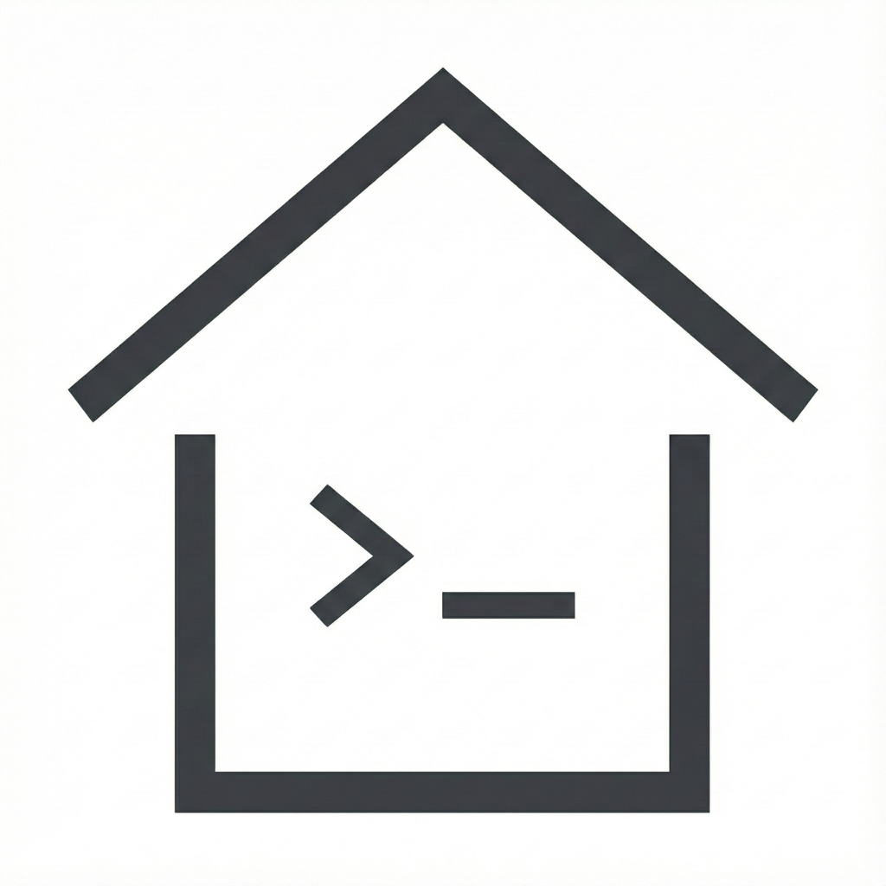

# Casa



Casa is a Mac Catalyst app that exposes your local HomeKit data as a localhost-only REST API, plus a CLI for scripting. It is designed for automation, agents, and power users who want a fast, reliable bridge into HomeKit on their own machine.

## Highlights

- Local-only API (loopback, no remote access)
- HomeKit module is opt-in and off by default
- Built-in CLI for fast scripting and automation
- Onboarding flow for permissions and setup
- Works with existing Home and accessories

## Quick start

1) Open `Casa.xcodeproj` in Xcode.
2) Select your Team and enable the HomeKit capability.
3) Build and run the app.
4) Complete onboarding (enable HomeKit and install CLI).

Build from the terminal:

```
./scripts/restart-mac.sh
```

## Using the API

Default base URL:

```
http://127.0.0.1:14663
```

If you set an auth token in the app, pass `X-Casa-Token: <token>`.

Common endpoints:

- `GET /health`
- `GET /homekit/accessories`
- `GET /homekit/accessories/:id`
- `GET /homekit/rooms`
- `GET /homekit/services`
- `GET /homekit/characteristics/:id`
- `PUT /homekit/characteristics/:id`
- `GET /homekit/schema`
- `GET /homekit/cameras`
- `GET /homekit/cameras/:id`

## CLI

The CLI is embedded into the app at build time and can be installed from Settings or onboarding.

Examples:

```
# Health check
casa health

# Browse HomeKit
casa devices
casa rooms
casa services

# Read/write a characteristic
casa characteristics get <uuid>
casa characteristics set <uuid> true

# Custom URL/token
CASA_URL=http://127.0.0.1:14663 CASA_TOKEN=token casa devices
```

## Development notes

- The server only binds to loopback (`127.0.0.1`).
- HomeKit access requires the entitlement; the module stays off until enabled in the app.
- If you change the port or auth token, update your CLI environment variables.

## Troubleshooting

- No accessories: confirm you have a Home in the Home app and grant HomeKit access in System Settings.
- Server not running: verify the port is free and check the app status badge.
- Missing CLI: use the Install CLI action in onboarding or Settings.

## Sparkle updates

Casa uses Sparkle for app updates. Set these build settings or environment values:

- `SPARKLE_FEED_URL` (appcast URL)
- `SPARKLE_PUBLIC_KEY` (Sparkle EdDSA public key)

The release workflow expects these secrets:

- `APPLE_CERT_BASE64`
- `APPLE_CERT_PASSWORD`
- `APPLE_TEAM_ID`
- `APPLE_SIGNING_IDENTITY`
- `APPLE_PROVISION_PROFILE_BASE64`
- `KEYCHAIN_PASSWORD`
- `SPARKLE_PRIVATE_KEY`
- `SPARKLE_PUBLIC_KEY`
